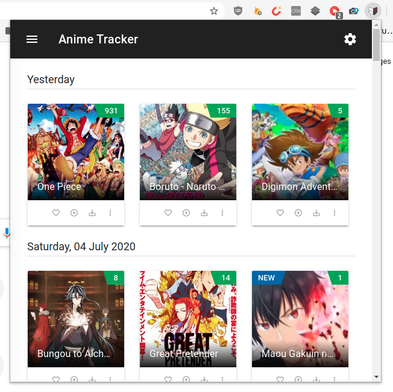

#  Anime Tracker

A web extension to keep tracking your favorite animes & get notified about new released episodes.



## Motivation

I watch animes almost daily or at least once or twice a week, & i wanted something like [youtube-viewer](https://github.com/AXeL-dev/youtube-viewer) to notify me of new released episodes, so instead of checking anime websites one by one & trying to remember which was the last episode i've watched, i thought that scraping those websites would be a great idea and would save me a significant time & effort (maybe i'm just super lazy :grin:).

<details>
  <summary>Expand to continue reading</summary>

  <br>
  Unfortunately, i didn't find a browser/client side web scraper available out there, so i just created a simple one composed of Angular's Http client service & a crafted HTML parser. I also, used some proxies to bypass <a href="https://en.wikipedia.org/wiki/Cross-origin_resource_sharing">CORS</a> limitations on browsers.
  <br><br>
  Okay, so why Angular? why not React or Vue?
  I mainly choosed Angular for its robust structure & advanced features, like: Pipes, directives, lazy loading, dependency injection & many others.
  Still its learning & master curve long, but i honestly love the way Angular forces you to use best practices on top of keeping your code flexible & maintainable.

</details>

## Installation

:warning: Due to [DMCA](https://en.wikipedia.org/wiki/Digital_Millennium_Copyright_Act) law, this web extension will be available as a zip file on github [releases](https://github.com/AXeL-dev/anime-tracker/releases), use it on your own risk.

[How to install?](https://github.com/AXeL-dev/install-webextension)

:mega: You can also [try it as a web application](https://axel-dev.github.io/anime-tracker/).

## ToDo

- [x] Scrape anime data from several websites.
- [x] Replace promises with observables for better performance?
- [x] Memorize last viewed/clicked episodes.
- [x] Auto-check & notify for new posted anime episodes.
- [ ] Implement missing/empty crawlers functions.
- [ ] Translations.
<!-- - [ ] Replace blox/material UI with [ng-zorro](https://ng.ant.design/) (keep the dark theme?). -->

## Development server

Run `ng serve` for a dev server. Navigate to `http://localhost:4200/`. The app will automatically reload if you change any of the source files.

## Build

Run `ng build` to build the project. The build artifacts will be stored in the `dist/` directory. Use the `--prod` flag for a production build.

## Package

Make sure you have the following package installed `npm install -g web-ext`. Then run:

```
npm run build && npm run package
```

## Credits

Icon made by [scaredofadulthood](https://www.reddit.com/user/scaredofadulthood/).

Some ideas were inspired by [manga-provider](https://github.com/adrianonrails/manga-provider) & [x-ray](https://github.com/matthewmueller/x-ray).

## License

This project is licensed under the [MPL2](LICENSE) license.
